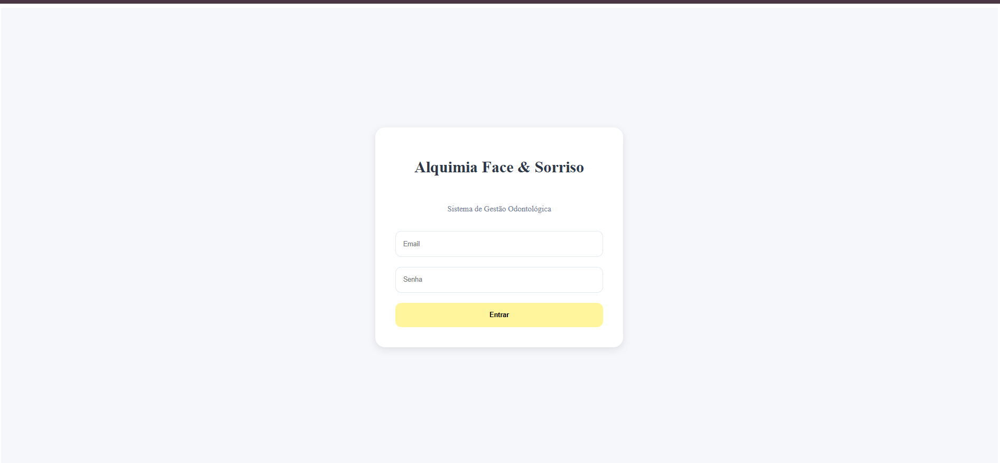
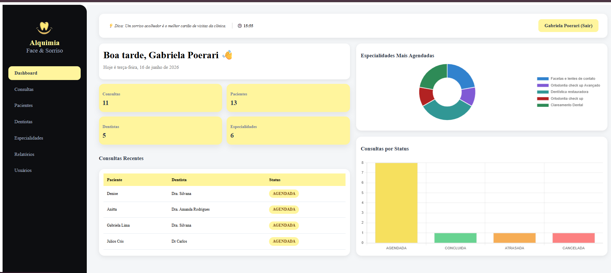
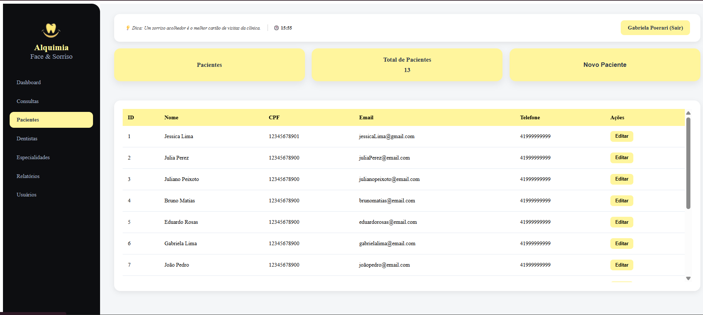
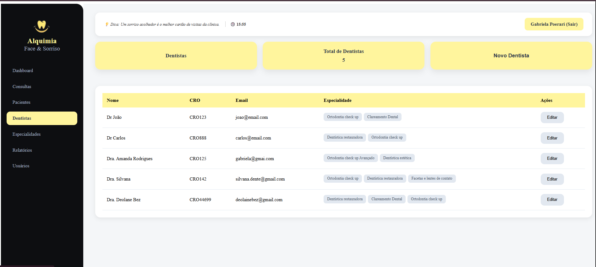
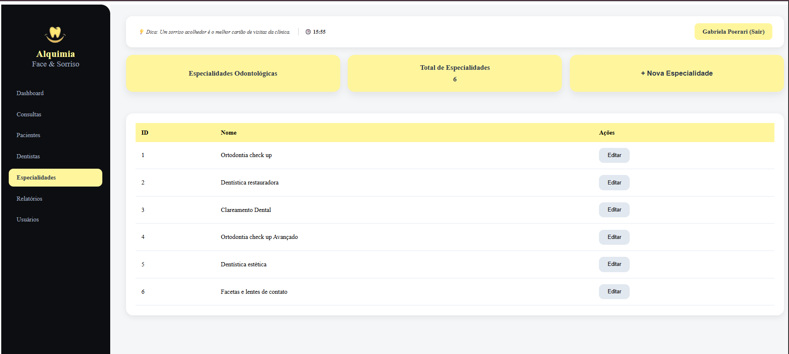
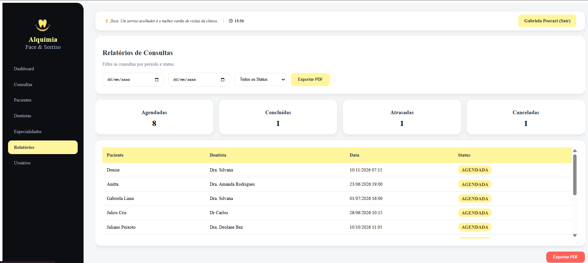

# 🦷 Alquimia Face Sorriso - Front-end

Sistema de gerenciamento para clínica odontológica, desenvolvido em **Angular**, com foco em organização de pacientes, dentistas, especialidades e consultas.

---

# 🚀 Tecnologias utilizadas

* Angular
* TypeScript
* HTML5 + CSS3
* Consumo de API REST (Spring Boot)

---

# ⚙️ Como executar o projeto

## Pré-requisitos

Antes de iniciar, você precisa ter instalado:

* Node.js (versão LTS recomendada)
* Angular CLI

## Instalar Angular CLI (caso não tenha)

```bash
npm install -g @angular/cli
```

## Instalação do projeto

### Clone o repositório

```bash
git clone https://github.com/Poerari/alquimia-face-sorriso-front.git
```

### Acesse a pasta do projeto

```bash
cd alquimia-face-sorriso-front
```

### Instale as dependências

```bash
npm install
```

## Executar o projeto

```bash
ng serve
```

O sistema estará disponível em:

```text
http://localhost:4200
```

---

# Integração com o Backend

Este projeto consome uma API desenvolvida em Spring Boot.

##  URL da API

```text
http://localhost:8080
```

⚠️ O backend deve estar em execução para o sistema funcionar corretamente.

---

# Funcionalidades do sistema

## 🏠 Dashboard

* Visão geral do sistema
* Total de pacientes, dentistas e consultas

## 👤 Pacientes

* Cadastro de pacientes
* Listagem
* Edição
* Exclusão

## 🦷 Dentistas

* Cadastro de dentistas
* Associação com especialidades
* Gerenciamento

## 🧩 Especialidades

* Cadastro de especialidades odontológicas

## 📅 Consultas

* Agendamento de consultas
* Seleção de paciente e dentista
* Definição de data e horário

---

# Fluxo da aplicação

```text
Dashboard → Módulos → CRUD completo (Criar, Listar, Editar, Excluir)
```

Exemplo:

```text
Pacientes → Novo paciente → Salvar → Lista atualizada
```

---

# 📸 Evidências do sistema

Adicionar capturas de tela das principais telas:















# 👩‍💻 Desenvolvedora 

Gabriela Poerari Baptista

---

# 📌 Observações finais

* O sistema depende do backend rodando na porta 8080.
* Sem o backend ativo, os dados não serão carregados.
* Certifique-se de configurar corretamente a URL da API no Angular.
